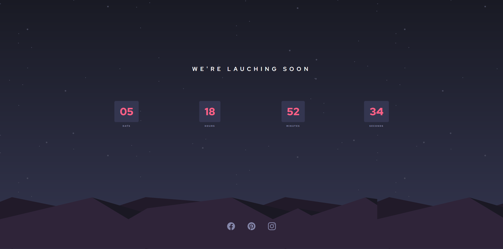

# Frontend Mentor - Launch countdown timer solution

This is a solution to the [Launch countdown timer challenge on Frontend Mentor](https://www.frontendmentor.io/challenges/launch-countdown-timer-N0XkGfyz-).

### The challenge

Users should be able to:

- See hover states for all interactive elements on the page
- See a live countdown timer that ticks down every second (start the count at 14 days)
- **Bonus**: When a number changes, make the card flip from the middle

### Screenshot

### Links
- Live Site URL: [Live Site](https://launch-count-down-timer-eta.vercel.app/)

### Built with

- Semantic HTML5 markup
- CSS custom properties
- Flexbox
- Mobile-first workflow
- [React](https://reactjs.org/) - JS library
- [Bootstrap](https://getbootstrap.com/) - Frontend Toolkit

### Useful resources

- [React <Countdown / >](https://github.com/ndresx/react-countdown) - A customizable countdown component for React.
- [Vercel](https://vercel.com) - Vercel builds a frontend-as-a-service product—they make it easy for engineers to deploy and run the user facing parts of their applications.
